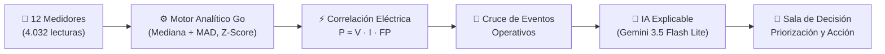

# Bia EnergyHub · AI Energy Management Platform

Plataforma inteligente de gestión energética y detección explicable de anomalías en medidores eléctricos. Combina procesamiento analítico robusto en Go (Arquitectura Hexagonal), explicabilidad generativa con Google Gemini (`gemini-3.5-flash-lite`) y Claude Sonnet con respaldo determinista, y un frontend interactivo en React 19 / TypeScript con la identidad visual corporativa de **[Bia Energy](https://www.bia.app/)**.

---

## ⚡ Resumen Ejecutivo del Proyecto

Este proyecto resuelve el desafío de transformar telemetría eléctrica pura (4.032 lecturas de 12 medidores en 14 días) en **decisiones operativas claras, priorizadas y justificadas cuantitativamente**.



---


## 🏗️ Arquitectura del Sistema

### Backend (Go 1.23 + Hexagonal Architecture)

```
backend/
├── cmd/api/main.go                 # Composition Root, dependencias y Graceful Shutdown
├── internal/
│   ├── domain/                     # Reglas de negocio e invariantes puras
│   │   ├── analysis/               # Entidades de corrida de análisis y pasos
│   │   ├── anomaly/                # Entidad Anomaly, estados y fórmula de prioridad
│   │   ├── detection/              # Algoritmos de baseline (MAD), Z-score, correlación
│   │   ├── event/                  # Eventos operativos y reglas de justificación
│   │   ├── meter/                  # Entidad Meter y derivación de estado
│   │   └── reading/                # Telemetría horaria
│   ├── app/                        # Casos de uso
│   │   ├── analysis/               # Orquestador del pipeline de 7 pasos
│   │   ├── anomalies/              # Consulta y actualización operativa de estado
│   │   ├── dashboard/              # Agregación de KPIs ejecutivos
│   │   └── meters/                 # Directorio de medidores y series temporales
│   └── infrastructure/             # Adaptadores de infraestructura
│       ├── ai/                     # Google Gemini + Claude + Fallback determinista
│       ├── httpapi/                # Enrutador REST (Chi), CORS dinámico y DTOs
│       ├── seed/                   # Seeder idempotente de CSVs
│       └── sqlite/                 # Repositorios SQLite CGO-free (modernc.org/sqlite)
```

### Frontend (React 19 + TypeScript + Vite + TailwindCSS + Chart.js)

```
frontend/src/
├── api/                            # Cliente tipado con proxy a /api/v1 y polling
├── components/
│   ├── analysis/RunAnalysisModal   # Modal interactivo con los 7 pasos en vivo
│   ├── charts/                     # Chart.js: TimeSeriesChart, Baseline24hChart, BreakdownChart
│   ├── common/                     # Badges, StatCards, ConfidenceMeter
│   └── layout/                     # Navbar y Sidebar con estética Bia Energy
└── views/
    ├── DashboardView               # KPIs ejecutivos, accesos rápidos y distribución
    ├── MetersView                  # Directorio con pestañas (Todos, Normal, Alerta, Crítica)
    ├── MeterDetailView             # Vista profunda de telemetría y perfil de 24 horas
    ├── AnomaliesView               # Hub de anomalías priorizadas por criticidad
    └── InvestigationView           # Sala de decisión: evidencia técnica y acciones operativas
```

---

## 🚀 Puesta en Marcha Rápida

### Prerrequisitos
- **Go** 1.22+ instalado
- **Node.js** 20+ instalado
- *(Opcional)* **Docker** & **Docker Compose**

### Opción 1: Ejecución Nativa Local

#### 1. Iniciar el Backend
```bash
cd backend
go mod tidy
go test ./...   # Ejecuta suite completa de pruebas unitarias y de integración
go run ./cmd/api
```
*El backend se inicia en `http://localhost:8080` (con prefijo `/api/v1`).*

#### 2. Iniciar el Frontend
```bash
cd frontend
npm install
npm run dev
```
*La aplicación web estará disponible en `http://localhost:5173` o `http://127.0.0.1:5173`.*

---

### Opción 2: Docker Compose
```bash
docker compose up --build
```

---

---

## 🔐 Credenciales de Acceso a la Plataforma (3 Usuarios Oficiales)

Para acceder a la plataforma web (`http://localhost:5173`), el sistema cuenta con **3 perfiles de usuario autorizados** con roles operativos específicos de **Bia Energy** y contraseñas independientes. Es posible ingresar indistintamente con el **usuario corto** o el **correo institucional**:

| # | Nombre del Operador | Usuario | Correo Institucional | Contraseña | Rol en la Plataforma | Sede Asignada |
|:---:|---|---|---|---|---|---|
| **1** | **Ing. Elena Morales** *(Recomendado para demo)* | `elena.morales` | `elena.morales@bia.app` | `Elena#Bia2026` | Analista Senior de Energía | Planta Norte · Operaciones |
| **2** | **Carlos Restrepo** | `carlos.restrepo` | `carlos.restrepo@bia.app` | `Carlos#Ops2026` | Director de Operaciones & Eficiencia | Gestión Corporativa |
| **3** | **Andrés Gómez** | `andres.gomez` | `andres.gomez@bia.app` | `Andres#Field2026` | Ingeniero de Campo & Subestaciones | Mantenimiento Técnico |

> [!TIP]
> En la esquina superior derecha del `Navbar`, al hacer clic en el perfil del usuario se despliega la tarjeta de sesión activa con el botón de **"Cerrar Sesión"** para alternar de usuario de forma fluida.

---


   - Haz clic en el perfil del Navbar y presiona **"Cerrar Sesión"**. Comprueba el retorno seguro al Login.
