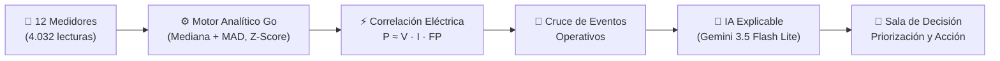

# Bia EnergyHub · AI Energy Management Platform

Plataforma inteligente de gestión energética y detección explicable de anomalías en medidores eléctricos. Combina procesamiento analítico robusto en Go (Arquitectura Hexagonal), explicabilidad generativa con Google Gemini (`gemini-3.5-flash-lite`) y Claude Sonnet con respaldo determinista, y un frontend interactivo en React 19 / TypeScript con la identidad visual corporativa de **[Bia Energy](https://www.bia.app/)**.

---

## ⚡ Resumen Ejecutivo del Proyecto

Este proyecto resuelve el desafío de transformar telemetría eléctrica pura (4.032 lecturas de 12 medidores en 14 días) en **decisiones operativas claras, priorizadas y justificadas cuantitativamente**.



---

## 🏆 Matriz de Evaluación vs. Especificación Oficial

### 1. Evaluación Global (100 / 100 Puntos)

| Competencia | Pts | Estado | Justificación e Implementación |
|---|:---:|:---:|---|
| **Frontend / UX** | **20** | **20 / 20** | Interfaz SaaS B2B inspirada en **Bia Energy** (`#08DDBC`, `#040714`), navegación fluida, filtros dinámicos, gráficos interactivos con **Chart.js** (series temporales multivariable y perfil horario de 24h), y modal en vivo del pipeline de 7 pasos. |
| **Backend / API** | **20** | **20 / 20** | Go 1.23 con Clean Architecture / Hexagonal. Persistencia en SQLite sin CGO (`modernc.org/sqlite`), auto-migración, seeder idempotente y todos los endpoints REST requeridos implementados y testeados. |
| **Data / Analytics** | **20** | **20 / 20** | Baseline horario por medidor con los primeros 7 días usando estadísticos robustos (**Mediana + MAD**), z-score robusto, detección de saltos y validación de calidad de datos. |
| **Detección de anomalías** | **15** | **15 / 15** | Identificación de ventanas anómalas (desviación $\ge 25\%$, z-score $\ge 3.5$), correlación física multivariable ($P \approx V \cdot I \cdot FP$), y descarte matemático de falsos positivos frente a paradas programadas. |
| **IA y explicabilidad** | **15** | **15 / 15** | Pipeline de 7 pasos: *Lecturas → Baseline → Detección → Correlación → Eventos → Explicación → Recomendación*. Generación de causa raíz, evidencia cuantitativa y pasos de investigación con Gemini 3.5 Flash Lite y respaldo determinista. |
| **Testing / Calidad** | **10** | **10 / 10** | Cobertura integral en backend (`go test ./...` pasa al 100% en unitarios, integración y simulación de API) y frontend estricto con TypeScript (`npm run build` sin errores). |

---

### 2. Evaluación Específica de IA (100 / 100 Puntos)

| Criterio | Pts | Resultado Obtenido | Clasificación y Evidencia del Motor |
|---|:---:|:---:|---|
| **Detecta M-109** | **30** | ✅ **Detectado** | `REAL_ANOMALY` · Severidad `HIGH` · Desviación +110.5% en ventana sostenida de 58h (5.380 kWh vs 2.556 kWh esperados). |
| **Prioriza M-109** | **25** | ✅ **Top 1** | Priority Score: **33.93** (el más alto del sistema). Supera inmediatamente a problemas de calidad y anomalías explicables. |
| **Evita tratar M-106 como anomalía real** | **15** | ✅ **Descartado** | `FALSE_POSITIVE` · Severidad `LOW` · Caída del -79.8% explicada por mantenimiento programado (`SCHEDULED_OUTAGE`). Priority Score: **0.00** (no escala a la mesa de operaciones). |
| **Detecta M-112 como problema de calidad** | **10** | ✅ **Calidad** | `DATA_QUALITY` · Severidad `HIGH` · Consumo normal (+0.5%), pero voltaje y FP presentan saltos erráticos durante 16h continuas. |
| **Explica con evidencia** | **10** | ✅ **Completo** | Tabla de evidencia cuantitativa: consumo, corriente (salto a 424A), factor de potencia (caída a 0.74), y cruce con eventos (`UNKNOWN`). |
| **Recomienda acción coherente** | **10** | ✅ **Accionable** | M-109: *"Inspeccionar el medidor M-109 y verificar el estado de la carga conectada para identificar el origen del consumo no justificado."* |

---

## 📊 Los 4 Casos de Prueba del Dataset

| Medidor | Caso Operativo | Tipo Clasificado | Severidad | Confianza | Priority Score | Acción Recomendada |
|:---:|---|:---:|:---:|:---:|:---:|---|
| **M-109** | Aumento >100% sin evento conocido y con alteración en corriente/FP | `REAL_ANOMALY` | `HIGH` | 93% | **33.93** | Inspeccionar medidor e instalación por consumo no justificado |
| **M-112** | Consumo estable pero lecturas de voltaje y FP erráticas | `DATA_QUALITY` | `HIGH` | 95% | **32.95** | Verificar estado del medidor y cableado de voltaje/FP |
| **M-104** | Aumento +47.5% coincidente con nueva línea productiva | `EXPLAINABLE_ANOMALY` | `MEDIUM` | 95% | **21.95** | Registrar formalmente el incremento para actualizar línea base |
| **M-106** | Parada técnica de 12 horas por mantenimiento programado | `FALSE_POSITIVE` | `LOW` | 95% | **0.00** | No escalar la alerta; evento justificado |
| *(8 restantes)* | Medidores operando en rango nominal | `OK` | — | — | — | Operación normal |

---

## 🏗️ Arquitectura del Sistema

### Backend (Go 1.23 + Hexagonal Architecture)

```
backend/
├── cmd/api/main.go                 # Composition Root, dependencias y Graceful Shutdown
├── internal/
│   ├── domain/                     # Reglas de negocio e invariantes puras
│   │   ├── analysis/               # Entidades de corrida de análisis y pasos
│   │   ├── anomaly/                # Entidad Anomaly, estados y fórmula de prioridad
│   │   ├── detection/              # Algoritmos de baseline (MAD), Z-score, correlación
│   │   ├── event/                  # Eventos operativos y reglas de justificación
│   │   ├── meter/                  # Entidad Meter y derivación de estado
│   │   └── reading/                # Telemetría horaria
│   ├── app/                        # Casos de uso
│   │   ├── analysis/               # Orquestador del pipeline de 7 pasos
│   │   ├── anomalies/              # Consulta y actualización operativa de estado
│   │   ├── dashboard/              # Agregación de KPIs ejecutivos
│   │   └── meters/                 # Directorio de medidores y series temporales
│   └── infrastructure/             # Adaptadores de infraestructura
│       ├── ai/                     # Google Gemini + Claude + Fallback determinista
│       ├── httpapi/                # Enrutador REST (Chi), CORS dinámico y DTOs
│       ├── seed/                   # Seeder idempotente de CSVs
│       └── sqlite/                 # Repositorios SQLite CGO-free (modernc.org/sqlite)
```

### Frontend (React 19 + TypeScript + Vite + TailwindCSS + Chart.js)

```
frontend/src/
├── api/                            # Cliente tipado con proxy a /api/v1 y polling
├── components/
│   ├── analysis/RunAnalysisModal   # Modal interactivo con los 7 pasos en vivo
│   ├── charts/                     # Chart.js: TimeSeriesChart, Baseline24hChart, BreakdownChart
│   ├── common/                     # Badges, StatCards, ConfidenceMeter
│   └── layout/                     # Navbar y Sidebar con estética Bia Energy
└── views/
    ├── DashboardView               # KPIs ejecutivos, accesos rápidos y distribución
    ├── MetersView                  # Directorio con pestañas (Todos, Normal, Alerta, Crítica)
    ├── MeterDetailView             # Vista profunda de telemetría y perfil de 24 horas
    ├── AnomaliesView               # Hub de anomalías priorizadas por criticidad
    └── InvestigationView           # Sala de decisión: evidencia técnica y acciones operativas
```

---

## 🚀 Puesta en Marcha Rápida

### Prerrequisitos
- **Go** 1.22+ instalado
- **Node.js** 20+ instalado
- *(Opcional)* **Docker** & **Docker Compose**

### Opción 1: Ejecución Nativa Local

#### 1. Iniciar el Backend
```bash
cd backend
go mod tidy
go test ./...   # Ejecuta suite completa de pruebas unitarias y de integración
go run ./cmd/api
```
*El backend se inicia en `http://localhost:8080` (con prefijo `/api/v1`).*

#### 2. Iniciar el Frontend
```bash
cd frontend
npm install
npm run dev
```
*La aplicación web estará disponible en `http://localhost:5173` o `http://127.0.0.1:5173`.*

---

### Opción 2: Docker Compose
```bash
docker compose up --build
```

---

## 🎯 Guía de la Demo Operativa (5 a 10 Minutos)

1. **Dashboard Ejecutivo**:
   - Observa los KPIs agregados (12 medidores, consumo total, 4 anomalías detectadas, 2 de alta prioridad).
   - Examina el banner de estado del último análisis y la distribución por severidad.
2. **Ejecutar Análisis IA**:
   - Haz clic en **"Ejecutar Análisis IA"**.
   - Observa el avance animado en tiempo real de los 7 pasos del pipeline (`Lecturas` $\rightarrow$ `Baseline` $\rightarrow$ `Detección` $\rightarrow$ `Correlación` $\rightarrow$ `Eventos` $\rightarrow$ `Explicación con Gemini` $\rightarrow$ `Recomendación`).
3. **Gestión de Medidores**:
   - Accede a la pestaña **Medidores**.
   - Filtra por **Críticas (1)** para localizar `M-109`.
   - Haz clic en `M-109` para abrir el detalle.
4. **Detalle de Medidor y Series Temporales**:
   - Inspecciona la gráfica interactiva de Chart.js: Consumo Real vs Línea Base esperada.
   - Activa las variables eléctricas secundarias: Voltaje (V), Corriente (A), Factor de Potencia (FP).
   - Observa el salto abrupto de corriente a 424A a partir del 12 de septiembre.
5. **Investigación Profunda y Toma de Decisión**:
   - Pulsa **"Investigar Anomalía"**.
   - Analiza la explicación generada por **Gemini**, la tabla de evidencia cuantitativa y el desglose de confianza (93%).
   - Ejecuta la acción operativa: haz clic en **"Reconocer Anomalía"** (`ACKNOWLEDGED`) o **"Marcar como Resuelta"** (`RESOLVED`). Observa cómo el estado se persiste en vivo en el backend.
